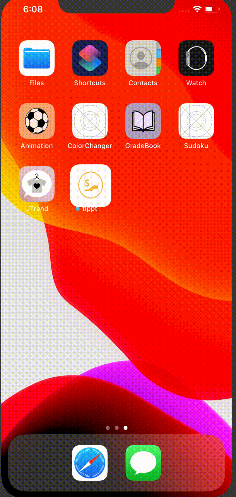

# Pre-work - *tippt*

**tippt** is a tip calculator application for iOS.

Submitted by: **Jennifer Lopez**

Time spent: **3** hours spent in total

## User Stories

The following **required** functionality is complete:

* [X] User can enter a bill amount, choose a tip percentage, and see the tip and total values.

The following **additional** features are implemented:

- [X] Improved + Colorful UI 
- [X] Tip Slider
- [X] Split Slider used for splitting a tab with friends

## Video Walkthrough 

Here's a walkthrough:

